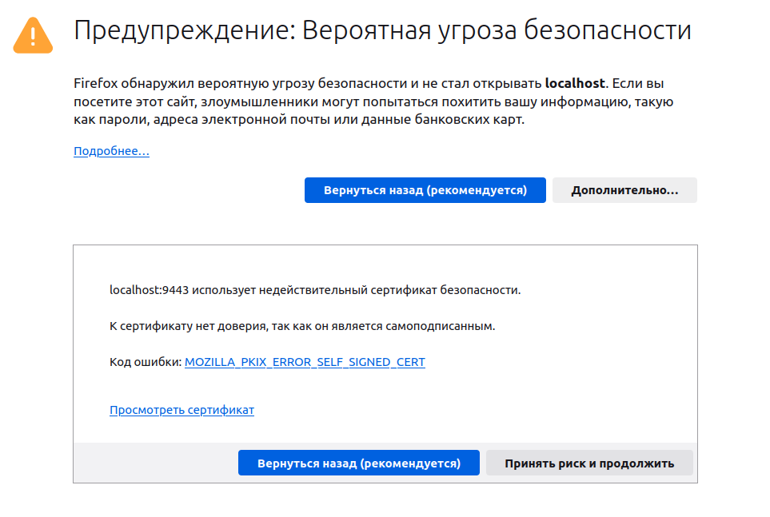
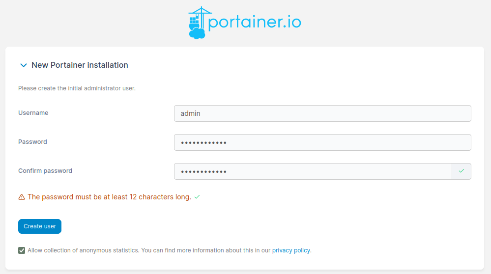
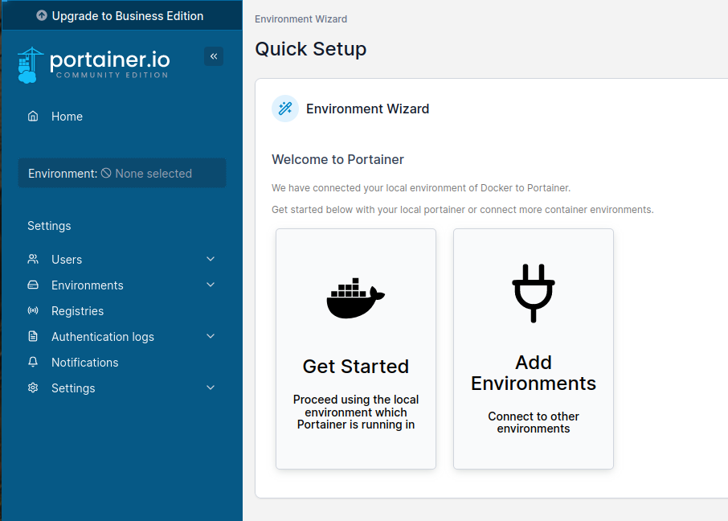
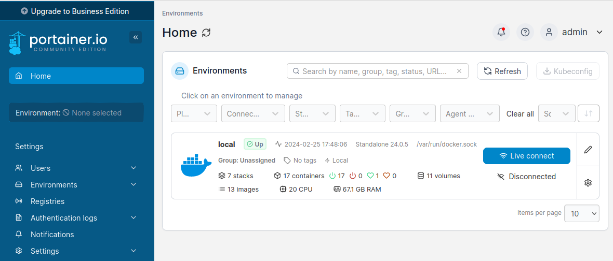
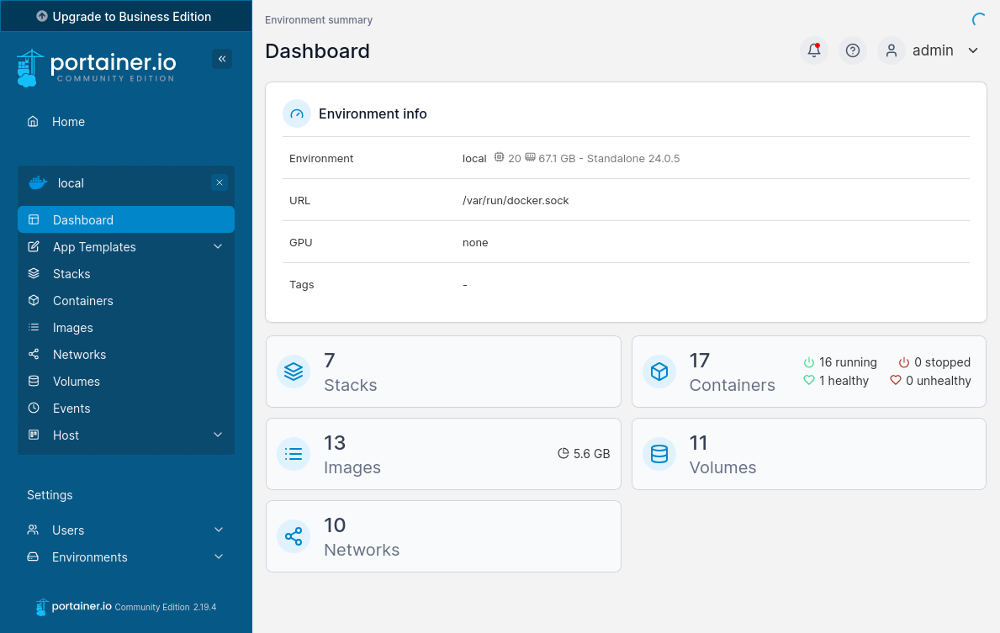

# Знакомство с Portainer (web-интерфейс для управления Docker)

Поднять окружение с приложением:
```bash
docker compose up -d
```

Перейти по адресу: https://localhost:9443/

Необходимо подтвердить риск в браузере:



Задать логин и пароль для нового пользователя:



В открывшемся интерфейсе выбрать "Get started":



В открывшейся странице перейти в единственное доступное `local` окружение:



Пример как выглядит локальное окружение:


